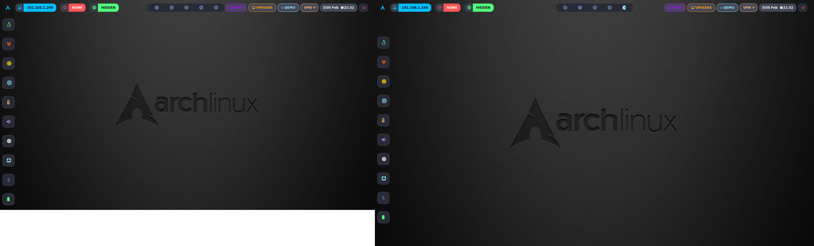

# ❄️ HyprArch-Dotfiles 

Bienvenido a mi configuración personal de **Hyprland** sobre **Arch Linux**. Un entorno diseñado para la productividad, la estética minimalista y el máximo rendimiento.

---

## 📸 Capturas de Pantalla


---

## 🛠️ Componentes del Sistema
Este ecosistema está compuesto por:

* **WM:** [Hyprland](https://hyprland.org/) (Dynamic Tiling Wayland Compositor)
* **Barra:** [Waybar](https://github.com/Alexays/Waybar) (Altamente personalizada con scripts de red)
* **Terminal:** [Kitty](https://sw.kovidgoyal.net/kitty/)
* **Editor:** [Neovim](https://neovim.io/) (LazyVim base)
* **Shell:** ZSH con [Starship](https://starship.rs/) prompt

---

## 📂 Estructura del Repositorio
```text
.
├── hypr/          # Atajos de teclado y reglas de ventanas
├── waybar/        # Estética de la barra y scripts de monitoreo
│   └── scripts/   # Utilidades para IP pública, target y monitoreo
├── nvim/          # Configuración de Neovim
├── kitty/         # Fuentes y colores de la terminal
└── zsh/           # Alias y funciones de la shell

---

## 🚀 Instalación Rápida
```text
    Clona el repositorio:
git clone [https://github.com/DaBit-Code/HyprArch-Dotfiles.git](https://github.com/DaBit-Code/HyprArch-Dotfiles.git)
cd HyprArch-Dotfiles

    Copia las configuraciones: Advertencia: Esto sobrescribirá tus archivos actuales. Haz un respaldo primero.
cp -r hypr waybar nvim kitty ~/.config/
cp zsh/.zshrc ~/

Dependencias necesarias: Asegúrate de tener instalados: hyprland, waybar, kitty, neovim, zsh, starship, ttf-font-awesome y otf-cascadia-code.

---

## 🛡️ Scripts Especiales (Waybar)

He incluido scripts personalizados para auditores y sysadmins:

    show-ip / hide-ip: Gestión visual de tu dirección IP Pública en la barra.

    set-target: Define un objetivo (IP/Dominio) para tenerlo siempre a la vista mientras trabajas. Puedes usar el alias #st IP/Dominio para fijar y #st sólo para limpiar.

    minifetch.sh: Un resumen rápido del sistema.
